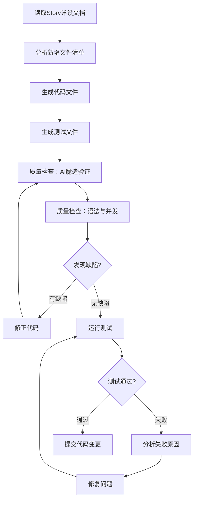

# 代码生成与质量闭环 Skill

基于设计文档和Story详设，完成代码生成、质量检查、DT测试验证、问题修复的自闭环流程。

## 何时使用

- Story详设完成后，开始实现代码
- 需要确保代码质量和测试通过
- 实现新功能模块的完整开发流程

---

## 工作流程概览



---

## 阶段一：代码生成

### 1.1 输入准备

**必需输入**：
- Story详设文档（`Story-X_*.md`）
- 主设计文档（可选，用于上下文参考）

**读取顺序**：
1. 读取Story详设文档的"新增文件详细设计"章节
2. 读取"开发任务清单"获取文件列表
3. 读取现有代码仓结构，确认文件路径和语言类型（Go/Java）

### 1.2 语言识别

根据目标模块识别语言类型：

| 模块 | 语言 | 代码路径 |
| --- | --- | --- |
| **GIDS** | Go | `GlobalInstanceDeliverService/src/` |
| **BGW** | Java | `BrowserGateway/src/main/java/` |
| **MC** | Go | `mobile/src/` |
| **browser-proxy** | Python | `browser-proxy/browser_proxy/` |

### 1.3 代码生成规则

#### 必须复用现有代码

| 检查项 | 操作 |
| --- | --- |
| **导入路径** | 使用`grep`搜索现有import路径，确认存在后再使用 |
| **方法调用** | 使用`grep`搜索方法名，确认签名匹配 |
| **配置项** | 复用现有环境变量/常量，不新建配置 |
| **服务地址** | 使用CSE服务发现（`cse://ServiceName/path`），不硬编码IP |
| **HTTP请求构建** | 优先使用`https.NewRequest()` builder，不手动构建HTTP请求 |
| **UUID生成** | 使用`github.com/google/uuid.New()`，不臆造时间戳拼接函数 |
| **获取本地IP** | 使用`https.GetLocalIP(ethEnv, defaultEth)`，不臆造硬编码函数 |

#### HTTP请求构建优先复用builder

| 场景 | 禁止做法 | 推荐做法 |
| --- | --- | --- |
| HTTP POST请求 | 手动`http.NewRequest` + 手动重试循环 | `https.NewRequest().WithRetry().Method().URL()...` |
| 获取本地IP | `getLocalIP()` 硬编码127.0.0.1 | `https.GetLocalIP("FABRIC_ETH", "bond-base")` |
| UUID生成 | `generateUUID()` 时间戳拼接 | `uuid.New().String()` |

**builder复用优势**：
- ✅ 链式调用，代码简洁
- ✅ 内置指数退避重试策略（2s→4s→8s→16s→32s→60s）
- ✅ 自动处理序列化、Header设置
- ✅ 与存量代码风格一致

**示例对比**：
```go
// ❌ 禁止：手动构建HTTP请求 + 手动重试
func doPost(url string, body []byte) error {
    req, err := http.NewRequestWithContext(ctx, http.MethodPost, url, bytes.NewReader(body))
    req.Header.Set("transaction-id", generateUUID())  // 臆造函数
    req.Header.Set("peer-ip", getLocalIP())           // 臆造函数
    for retry := 0; retry < 3; retry++ {
        resp, err := client.Do(req)
        time.Sleep(5 * time.Second)  // 固定间隔（未复用存量退避策略）
    }
}

// ✅ 推荐：复用存量builder
response := https.NewRequest(client).
    WithRetry(3).                    // 指数退避重试
    Method("POST").
    URL(url).
    Header("transaction-id", uuid.New().String()).  // 复用google/uuid
    Header("peer-ip", peerIP).
    ParamFromInterface(body).        // 自动序列化
    Complete().
    Do()
```

#### 必须符合现有代码实现风格（全面检查）

**代码风格一致性是强制要求**：所有新增代码必须与现有代码仓的实现风格一致，包括但不限于：

| 风格类别 | 检查内容 | 检查方法 | 参考文件 |
| --- | --- | --- | --- |
| **main.go启动风格** | 初始化调用方式 | 对比现有初始化调用 | `main.go` |
| **单例模式实现** | 单例初始化方式、锁保护 | 对比现有单例实现 | `service/*.go` |
| **接口定义风格** | 接口命名、方法签名 | 对比现有接口定义 | `service/*.go` |
| **Service层实现** | 构造函数、私有实现类、包级变量 | 对比现有Service实现 | `service/*.go` |
| **DAO层实现** | BaseInterface继承、方法定义 | 对比现有DAO实现 | `dao/*.go` |
| **实体定义风格** | orm标签、TableName方法、init注册 | 对比现有实体定义 | `models/db/*.go` |
| **错误处理风格** | error返回、日志打印、错误传播 | 对比现有错误处理 | 全仓代码 |
| **日志打印风格** | logger调用方式、日志级别 | 对比现有日志打印 | 全仓代码 |
| **并发安全模式** | sync.RWMutex/sync.Mutex/sync.Once使用 | 对比现有并发安全实现 | 全仓代码 |
| **goroutine启动** | 是否需要go前缀、后台任务模式 | 对比现有后台任务 | `main.go` |

**风格一致性检查示例**：

```markdown
## 代码实现风格对比分析

### 1. 单例模式实现风格

| 现有Service | 单例实现方式 | 特点 |
| --- | --- | --- |
| MonitorService | `var instance; func NewXXX() { return instance }` | 包级变量 + New函数 |
| AuthService | `var instance; func NewXXX() { return instance }` | 包级变量 + New函数 |

**新增Service应采用**：`var xxxService *xxxServiceImpl; func NewXXXService() XXXService`

### 2. Service层接口与实现风格

| 现有Service | 接口定义 | 实现类命名 |
| --- | --- | --- |
| MonitorService | `type MonitorService interface` | `MonitorServiceImpl` |
| AuthService | `type AuthService interface` | `AuthServiceImpl` |

**新增Service应采用**：接口名`XXXService`，实现类`xxxServiceImpl`（小写开头）

### 3. DAO层继承风格

| 现有DAO | 继承方式 | EntityType设置 |
| --- | --- | --- |
| UserDao | `BaseInterface`嵌入 | `EntityType: &db.User{}` |
| ImeiAllowlistDao | `BaseInterface`嵌入 | `EntityType: &db.ImeiAllowlist{}` |

**新增DAO应采用**：`type XxxDao struct { BaseInterface }` + `EntityType: &db.Xxx{}`

### 4. 实体定义风格

| 现有实体 | orm标签风格 | TableName方法 | init注册 |
| --- | --- | --- | --- |
| User | `orm:"pk;column(key)"` | `func TableName()` | `orm.RegisterModel()` |
| UserBind | `orm:"pk;column(key)"` | `func TableName()` | `orm.RegisterModel()` |

**新增实体应采用**：`orm:"pk;column(xxx)"` + `TableName()` + `init(){ orm.RegisterModel() }`

### 5. main.go启动风格

| 现有服务 | 启动方式 | 风格 |
| --- | --- | --- |
| DB连接 | `go dao.EnsureConnectGaussDB()` | goroutine后台 |
| Config刷新 | `service.StartRefreshConfigTask()` | 直接调用Start函数 |
| Scheduler | `scheduler.StartDataCleanupScheduler()` | 直接调用Start函数 |

**新增服务应采用**：`go service.StartXXX()`或`service.StartXXX()`（根据是否需要后台运行）
```

**风格修正示例**：

```go
// 问题代码：Service层风格不一致
type MasterElectionService interface { ... }
var masterElectionService *masterElectionServiceImpl  // 包级变量命名不一致
func NewMasterElectionService() MasterElectionService {
    masterElectionService = &masterElectionServiceImpl{ ... }  // 应使用once.Do
    return masterElectionService
}

// 正确代码：与现有MonitorService风格一致
type MasterElectionService interface { ... }
type masterElectionServiceImpl struct { ... }  // 小写开头
var masterElectionService *masterElectionServiceImpl
var electionOnce sync.Once

func NewMasterElectionService() MasterElectionService {
    electionOnce.Do(func() {
        masterElectionService = &masterElectionServiceImpl{ ... }
    })
    return masterElectionService
}

// 同时提供Start函数（与StartRefreshConfigTask风格一致）
func StartMasterElection() {
    NewMasterElectionService()
    go masterElectionService.electionLoop()
}
```

#### 代码质量基线（Go）

| 要求 | 标准 |
| --- | --- | --- |
| **单例初始化** | 使用`sync.Once`保护 |
| **context参数** | 使用`context.TODO()`而非`nil` |
| **错误处理** | **所有error返回值必须检查处理**，禁止Unhandled error |
| **资源释放** | HTTP Body、File、Request必须defer Close |
| **注释风格** | 中文注释，格式：`// 函数名 功能说明`，参考现有代码 |

**Unhandled error检查要点**：
- **禁止忽略error返回值**：所有返回error的函数调用必须检查并处理
- **处理方式**：
  - 记录日志：`if err := xxx(); err != nil { logger.Errorf(...) }`
  - 返回错误：`if err := xxx(); err != nil { return err }`
  - 业务处理：根据error进行分支逻辑
- **常见遗漏场景**：
  - DAO层Update/Insert/Delete操作
  - HTTP Body.Close()
  - File.Close()
  - orm操作
- **检查方法**：使用`go vet ./...`检测Unhandled error警告

**注释风格要求**：
- **格式**：`// 函数名 功能说明`（中文注释）
- **注释规则（重要）**：
  - ✅ **必须注释**：所有公共函数（func开头，包括导出函数和公共方法）
  - ❌ **不注释**：
    - 接口定义：`type XXXService interface` — 接口名已说明用途
    - 实现类：`type xxxServiceImpl struct` — private类无需注释
    - 数据实体：`type XxxEntity struct` — models层实体无注释
    - DAO结构体：`type XxxDao struct` — dao层结构体无注释
    - 常量定义：`const XXX = ...` — 常量名已说明用途
  - ✅ **可选注释**：复杂字段说明（极少使用）
- **示例**：
  ```go
  // Query 查询选主记录
  func (d *GidsMasterDao) Query() (*db.GidsMaster, error) { ... }
  
  // UpdateTimestamp 更新时间戳
  func (d *GidsMasterDao) UpdateTimestamp(timestamp time.Time) error { ... }
  
  // StartMasterElection 启动选主服务
  func StartMasterElection() { ... }
  ```
- **版权声明**：文件首行必须包含版权声明
  ```go
  // Copyright (c) Huawei Technologies Co., Ltd. 2026. All rights reserved.
  ```
- **参考文件**：查看`src/dao/*.go`、`src/service/*.go`现有注释风格

#### 代码质量基线（Java）

| 要求 | 标准 |
| --- | --- |
| **单例初始化** | Spring `@Component` 单例，无需额外锁 |
| **空值检查** | 调用可能为null的对象前判空 |
| **资源释放** | 线程池`@PreDestroy` shutdown |
| **定时任务** | 使用`ScheduledExecutorService`而非`@Scheduled` |

### 1.4 文件生成模板

**Go文件模板**：
```go
//go:build !custom
// +build !custom

package xxx

import (
    "context"
    "sync"
)

var instance *xxxServiceImpl
var once sync.Once

func NewXXXService() XXXService {
    once.Do(func() {
        instance = &xxxServiceImpl{}
    })
    return instance
}
```

**Java文件模板**：
```java
package com.huawei.xxx;

import org.springframework.stereotype.Component;
import javax.annotation.PostConstruct;
import javax.annotation.PreDestroy;

@Component
public class XxxServiceImpl implements XxxService {
    
    @PostConstruct
    public void init() {
        // 初始化逻辑
    }
    
    @PreDestroy
    public void destroy() {
        // 清理逻辑
    }
}
```

**测试文件模板（Go）**：
```go
package xxx

import (
    "os"
    "testing"
    
    "github.com/stretchr/testify/assert"
)

func TestXXX_Success(t *testing.T) {
    // 测试代码
}
```

**测试文件模板（Java）**：
```java
package com.huawei.xxx;

import org.junit.Test;
import static org.junit.Assert.*;

public class XxxServiceImplTest {
    
    @Test
    public void testXxxSuccess() {
        // 测试代码
    }
}
```

---

## 阶段二：质量检查

### 2.1 检查清单

| 检查项 | 检查方法 | 优先级 |
| --- | --- | --- |
| **已有接口复用检查** | 对比新增功能与现有接口，检查是否遗漏复用 | **极高（新增）** |
| **Unhandled error检查** | `go vet ./...` 检测未处理的error返回值 | **极高** |
| **导入路径验证** | `grep -r "导入路径" --include="*.go"` 确认存在 | 高 |
| **方法存在验证** | `grep -r "func 方法名" --include="*.go"` 确认签名 | 高 |
| **代码风格一致性** | 对比main.go现有初始化风格，确保一致 | **高** |
| **注释风格检查** | 检查是否使用中文注释，格式是否正确 | 高 |
| **未使用变量** | 人工检查每个变量是否被引用 | 高 |
| **context传nil** | 人工检查ContextDo调用 | 中 |
| **单例无锁保护** | 人工检查sync.Once使用 | 高 |

### 2.2 已有接口复用检查（新增环节）

**检查目的**：确保新增代码最大化复用现有接口，避免重复实现和臆造函数。

### 2.2.1 常见臆造函数案例（必查项）

| 臆造函数 | 存量接口 | 检查命令 | 修正动作 |
| --- | --- | --- | --- |
| `generateUUID()` 时间戳拼接 | `github.com/google/uuid.New()` | grep "uuid.New" | 删除臆造函数，导入google/uuid |
| `getLocalIP()` 硬编码127.0.0.1 | `https.GetLocalIP(ethEnv, defaultEth)` | grep "GetLocalIP" | 删除臆造函数，复用存量接口 |
| 手动HTTP请求构建 + 手动重试 | `https.NewRequest().WithRetry()` | grep "NewRequest" | 改为builder链式调用 |
| `fmt.Sprintf("%d-%d", time.Now()...)` | `uuid.New().String()` | grep "uuid" | 使用标准库UUID |

**检查步骤**：
1. 对新增的private函数，使用grep搜索存量代码是否有类似实现
2. 检查导入的包是否有对应方法（如uuid包的New()方法）
3. 优先使用存量builder而非手动构建HTTP请求
4. 检查是否有硬编码值（如127.0.0.1）应改为动态获取

**臆造函数示例**：
```go
// ❌ 臆造函数：generateUUID
func generateUUID() string {
    return fmt.Sprintf("%d-%d", time.Now().UnixNano(), time.Now().Nanosecond())
}

// ✅ 正确：使用google/uuid
import "github.com/google/uuid"
transactionID := uuid.New().String()

// ❌ 臆造函数：getLocalIP
func getLocalIP() string {
    return "127.0.0.1"  // 硬编码
}

// ✅ 正确：使用存量接口
peerIP := "unknown"
if ip, err := https.GetLocalIP("FABRIC_ETH", "bond-base"); err == nil {
    peerIP = ip
}
```

### 2.2.2 已有接口复用检查步骤

**检查目的**：确保新增代码最大化复用现有接口，避免重复实现。

**检查步骤**：

1. **分析新增功能逻辑**：
   - 列出新增代码需要实现的功能点（如：查询FM告警、SNMP上报、DB写入）
   
2. **搜索现有接口**：
   - 对每个功能点，使用 `grep` 搜索现有实现
   - 搜索关键词：功能名称、方法名、结构体名
   
3. **对比重复实现**：
   - 检查新增代码是否重复定义了现有已有的方法/结构体
   - 列出重复项，标注可复用的现有接口
   
4. **重构代码**：
   - 删除重复实现，改为调用现有接口
   - 更新导入，确保引用正确的包

**检查报告格式**：

```markdown
### 2.2.1 已有接口复用检查

| 新增功能点 | 新增代码实现 | 现有接口 | 是否遗漏复用 | 处理动作 |
| --- | --- | --- | --- | --- |
| 查询FM告警 | `queryFmAlarms()` | `GetAllActiveAlarmFromFMService()` | ❌ 遗漏 | 改为调用现有接口 |
| SNMP上报 | `buildSnmpRequest() + SendAlarm()` | `HandleFaultAlarm()` | ❌ 遗漏 | 改为调用现有接口 |
| DB写入 | `dao.Insert()` | 已在HandleFaultAlarm中 | ✅ 正常 | 保持现状 |
| mapAlarmLevel | 新增定义 | `alarm_event_service.mapAlarmLevel()` | ❌ 遗漏 | 删除重复定义 |

**重复实现汇总**：
- `buildSnmpAlarmRequest()` — 与 `alarm_event_service.go:91` 重复
- `mapAlarmLevel()` — 与 `alarm_event_service.go:130` 重复
- `parseMois()` — 与 `alarm_event_service.go:119` 重复
- `FmAlarmInfo` 结构体 — 与 `AlarmParamInfo` 功能重叠

**重构方案**：
1. 删除 `queryFmAlarms()`，改为调用 `GetAllActiveAlarmFromFMService()`
2. 删除 `buildSnmpAlarmRequest/mapAlarmLevel/parseMois`，改为调用 `HandleFaultAlarm/HandleClearAlarm`
3. 删除 `FmAlarmInfo` 结构体，使用 `AlarmParamInfo`
```

**检查命令示例**：

```bash
# 搜索FM查询相关接口
grep -rn "GetAll.*Alarm\|Query.*Alarm" --include="*.go" src/service/

# 搜索SNMP上报相关接口
grep -rn "SendAlarm\|HandleFault\|HandleClear" --include="*.go" src/service/

# 搜索重复定义的方法名
grep -rn "func.*buildSnmp\|func.*mapAlarmLevel\|func.*parseMois" --include="*.go" src/

# 搜索结构体定义
grep -rn "type.*AlarmInfo\|type.*AlarmParam" --include="*.go" src/
```

**代码风格一致性检查步骤**：

1. 读取目标文件（如main.go），分析现有初始化方式
2. 列出现有服务的启动风格表格
3. 对比新增服务的启动方式是否一致
4. 如不一致，提供修正方案并更新代码

### 2.3 检查报告格式

```markdown
## 代码质量检查报告

### 2.3.1 已有接口复用检查（新增）

| 新增功能点 | 新增代码实现 | 现有接口 | 是否遗漏复用 | 处理动作 |
| --- | --- | --- | --- | --- |
| 查询FM告警 | `queryFmAlarms()` | `GetAllActiveAlarmFromFMService()` | ❌ 遗漏 | 改为调用现有接口 |
| SNMP上报 | `buildSnmpRequest()` | `HandleFaultAlarm()` | ❌ 遗漏 | 改为调用现有接口 |
| DB写入 | `dao.Insert()` | 已在HandleFaultAlarm中 | ✅ 正常 | 保持现状 |

**重构方案**：删除重复实现 X 处，复用现有接口 Y 处。

### 2.3.2 Unhandled error检查

| 文件 | 行号 | 问题代码 | 修正建议 |
| --- | --- | --- | --- |
| master_election_service.go | 131 | `s.dao.UpdateTimestamp(now)` | 添加error检查并记录日志 |
| master_election_service.go | 182 | `s.dao.UpdateIsRegistered(false)` | 添加error检查并记录日志 |

**修正代码示例**：
```go
// 原代码（Unhandled error）
s.dao.UpdateTimestamp(now)

// 修正后
if err := s.dao.UpdateTimestamp(now); err != nil {
    logger.Errorf("Failed to update timestamp: %v", err)
}
```

### 2.3.3 AI臆造检查

| 检查项 | 结果 | 说明 |
| --- | --- | --- |
| 臆造导入路径 | ✅/❌ | 列出所有导入，逐个grep验证 |
| 臆造方法调用 | ✅/❌ | 列出所有方法调用，逐个grep验证 |

### 2.3.4 代码风格一致性检查

| 现有服务 | 启动方式 | 风格特点 |
| --- | --- | --- |
| dao.EnsureConnectGaussDB() | `go dao.EnsureConnectGaussDB()` | goroutine后台任务 |
| service.StartRefreshConfigTask() | 直接调用 | 无需创建实例 |
| scheduler.StartDataCleanupScheduler() | 直接调用 | 无需创建实例 |

| 新增服务 | 当前实现 | 是否一致 | 修正建议 |
| --- | --- | --- | --- |
| MasterElection | `xxx := NewXXX(); go xxx.Start()` | ❌ 不一致 | 改为`go service.StartXXX()` |

### 2.3.5 注释风格检查

| 检查项 | 当前实现 | 是否符合要求 | 修正建议 |
| --- | --- | --- | --- |
| 版权声明 | 缺失 | ❌ 不符合 | 添加版权声明 |
| 函数注释格式 | 英文注释 | ❌ 不符合 | 改为中文注释：`// 函数名 说明` |
| 注释内容 | 无说明 | ❌ 不符合 | 添加功能说明 |

**修正示例**：
```go
// 原代码
func Query() (*db.GidsMaster, error) { ... }

// 修正后
// Query 查询选主记录
func Query() (*db.GidsMaster, error) { ... }
```

### 2.3.6 其他检查

| 检查项 | 结果 | 说明 |
| --- | --- | --- |
| 未使用变量 | ✅/❌ | 检查每个变量是否被引用 |
| context传nil | ✅/❌ | 检查ContextDo调用 |
| 单例无锁保护 | ✅/❌ | 检查sync.Once使用 |
```

### 2.4 修正流程

**发现缺陷后**：
1. 记录缺陷详情（文件、行号、问题类型）
2. 提供修正代码片段
3. 更新代码文件
4. 重新执行质量检查

**Unhandled error修正流程**：
1. 使用`go vet ./...`检测所有Unhandled error警告
2. 为每个遗漏的error检查添加处理逻辑
3. 选择合适的处理方式：
   - 需要中断流程：返回error
   - 仅需记录：使用logger记录error
   - 业务分支：根据error进行判断
4. 重新编译和vet检查，确保无遗漏

**已有接口复用缺陷修正流程**：
1. 列出所有重复实现的方法/结构体
2. 确定可复用的现有接口及调用方式
3. 重构代码，删除重复实现，改为调用现有接口
4. 重新编译，确保无语法错误
5. 运行测试，验证功能正确性

**注释风格修正流程**：
1. 检查文件首行是否有版权声明
2. 检查所有公共函数是否有注释
3. 将注释改为中文格式：`// 函数名 说明`
4. **删除多余注释**：接口、实现类、实体、DAO结构体、常量均不需要注释
5. 参考现有代码确保风格一致

**修正闭环条件**：所有高严重度缺陷修正完成

---

## 阶段三：DT测试验证

### 3.1 测试执行命令

```bash
# 运行单元测试
go test -v ./src/service/...

# 运行DT测试
go test -v ./src/service/... -run TestDT
```

### 3.2 测试验证清单

| 测试类型 | 验证项 | 通过标准 |
| --- | --- | --- |
| **UT测试** | 所有单元测试用例通过 | assert.NoError() / assert.Equal() |
| **DT测试** | 集成测试流程通过 | 端到端流程验证 |

### 3.3 测试失败处理

**分析步骤**：
1. 查看测试日志，定位失败断言
2. 分析失败原因（Mock配置、逻辑错误、边界条件）
3. 修正代码或测试用例
4. 重新运行测试

**修正闭环条件**：所有测试用例通过

---

## 阶段四：提交代码变更

### 4.1 提交前检查

```bash
# 检查所有变更文件
git status

# 检查变更内容
git diff
```

### 4.2 提交Commit

**Commit信息格式**：
```
Story-X：{Story名称} - {主要功能描述}

- 新增XXX服务实现
- 新增XXX测试用例
```

**示例**：
```bash
git add src/service/snmp_alarm_service.go
git add src/service/snmp_alarm_service_test.go
git add src/dao/alarm_event_dao.go

git commit -m "Story-5：GIDS SNMP告警上报 - 实现FM回调后SNMP上报

- 新增snmp_alarm_service.go：组装SNMP请求，上报至SFMU
- 新增alarm_event_service.go：封装DAO + RWMutex保护
- 新增alarm_event_dao.go：告警事件DB操作
- 新增测试文件：UT/DT测试用例"
```

### 4.3 Commit信息规范

| 要素 | 内容 | 示例 |
| --- | --- | --- |
| **Story标识** | Story-X | Story-5 |
| **Story名称** | Story详设中的名称 | GIDS SNMP告警上报 |
| **功能描述** | 本次变更的核心功能 | 实现FM回调后SNMP上报 |
| **文件清单** | 主要新增/修改文件 | 新增snmp_alarm_service.go |

---

## 自闭环规则

| 触发条件 | 处理动作 |
| --- | --- |
| **质量检查发现缺陷** | 自动修正代码，重新检查 |
| **测试用例失败** | 分析原因，修正代码，重新执行 |

**闭环终止条件**：
- 所有高严重度缺陷修正完成
- 所有测试用例通过

---

## 注意事项

1. **已有接口复用检查必须优先执行**：代码生成后立即检查是否有遗漏复用现有接口，避免重复实现
2. **只生成代码文件**：不生成验收报告等文档，避免文档混乱
3. **优先复用现有代码**：不新建导入路径、配置项、方法
4. **代码风格必须一致**：对比main.go现有初始化风格，确保新增代码风格一致
5. **质量检查立即执行**：代码生成后立即检查，避免缺陷累积
6. **每次修正后重新检查**：确保闭环完整
7. **变更文件只能在对应代码仓提交**：跨仓变更需分别提交git commit