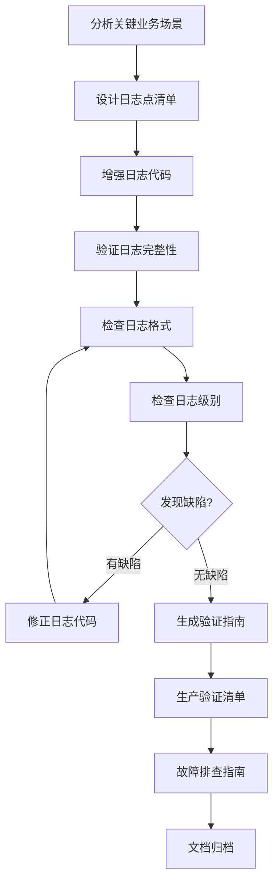

# 日志验证 Skill

用于代码实现阶段的日志设计、检查和验证，确保环境部署后的可观测性。

## 何时使用

- 代码实现完成后，准备提交前
- 需要增强日志可观测性
- 环境部署前的日志验证
- 故障排查需要日志分析指南

---

## 工作流程概览



---

## 阶段一：日志设计

### 1.1 关键业务场景分析

**识别关键事件**：

| 事件类型 | 必须日志 | 示例 |
| --- | --- | --- |
| **服务启动/停止** | ✅ | "Start service", "Stop service" |
| **状态变更** | ✅ | Master→Standby, Active→Inactive |
| **关键操作成功** | ✅ | "Become master successfully", "Subscription registered" |
| **关键操作失败** | ✅ | "Grab master failed", "Connection timeout" |
| **定时任务执行** | ⚠️ 可选 | "Refresh timestamp", "Health check passed" |
| **异常检测** | ✅ | "Master timeout detected", "Connection lost" |
| **错误重试** | ✅ | "Retry attempt 3/5", "Retry failed" |

### 1.2 日志点设计清单

**清单模板**：

```markdown
## [模块名]日志点设计清单

### 核心业务流程

| 关键事件 | 当前日志 | 是否完整 | 增强建议 |
| --- | --- | --- | --- |
| **服务启动** | ❌ 无日志 | ❌ 不完整 | 添加启动日志，包含关键参数 |
| **首次抢主** | ❌ 无日志 | ❌ 不完整 | 添加抢主意图日志 |
| **抢主成功** | ✅ 有日志 | ✅ 完整 | 保持现状 |
| **抢主失败** | ✅ 有日志 | ⚠️ 部分完整 | 添加失败原因 |

### 定时任务

| 任务名称 | 执行频率 | 日志需求 | 增强建议 |
| --- | --- | --- | --- |
| **时间戳刷新** | 5秒 | ✅ 必需 | 添加刷新日志，包含时间戳值 |
| **超时检测** | 5秒 | ✅ 必需 | 添加超时检测日志，包含时间差 |

### 异常场景

| 异常类型 | 当前日志 | 是否完整 | 增强建议 |
| --- | --- | --- | --- |
| **DB连接失败** | ✅ 有日志 | ✅ 完整 | 保持现状 |
| **Upsert失败** | ✅ 有日志 | ✅ 完整 | 保持现状 |
| **时间戳更新失败** | ✅ 有日志 | ✅ 完整 | 保持现状 |
```

### 1.3 日志格式规范

**统一前缀格式**：

```go
// ✅ 推荐：模块前缀 + 事件描述
logger.Infof("[ModuleName] Event description, key1: %v, key2: %v", value1, value2)

// 示例
logger.Infof("[MasterElection] Start master election service, pod: %s, period: 5s, timeout: 15s", podName)
logger.Infof("[MasterElection] Become master successfully, pod: %s, is_registered: %v", podName, isRegistered)
logger.Errorf("[MasterElection] Failed to update timestamp: %v", err)

// ❌ 禁止：无前缀的日志
logger.Infof("Start service")  // 无法区分模块
logger.Infof("Become master")  // 无法定位来源
```

**日志级别规范**：

| 级别 | 使用场景 | 示例 |
| --- | --- | --- |
| **INFO** | 正常业务流程、状态变更、定时任务 | 服务启动、抢主成功、刷新时间戳 |
| **WARN** | 异常但可恢复、需要关注的事件 | 抢主失败、超时检测、重试开始 |
| **ERROR** | 错误、失败、需要立即处理 | DB连接失败、Upsert失败、更新失败 |
| **DEBUG** | 调试信息、详细流程（开发环境使用） | 详细的中间状态、参数值 |

**环境日志级别建议**：

| 环境 | 建议日志级别 | 说明 |
| --- | --- | --- |
| **开发环境** | DEBUG | 输出详细日志，便于调试 |
| **测试环境** | INFO | 输出关键事件，验证功能 |
| **生产环境** | WARN或ERROR | 仅输出警告和错误，减少日志量 |

**关键参数包含要求**：

| 参数类型 | 必须包含 | 示例 |
| --- | --- | --- |
| **实例标识** | ✅ | pod_name, instance_id, transaction_id |
| **业务参数** | ✅ | master_name, timestamp, timeout_value |
| **错误详情** | ✅ | error_message, error_code, stack_trace（可选） |
| **时间信息** | ⚠️ 可选 | timestamp_age, duration, retry_count |

---

## 阶段二：日志增强

### 2.1 日志增强模板

**Go语言模板**：

```go
// 服务启动日志增强
func (s *ServiceImpl) Start() {
    logger.Infof("[ServiceName] Start service, instance: %s, config: %v", s.instanceID, s.config)
    // ... 业务逻辑
}

// 状态变更日志增强
func (s *ServiceImpl) changeState(newState State) {
    oldState := s.state
    s.state = newState
    logger.Infof("[ServiceName] State changed, from: %v -> to: %v, instance: %s", oldState, newState, s.instanceID)
}

// 关键操作成功日志增强
func (s *ServiceImpl) criticalOperation() {
    err := doOperation()
    if err != nil {
        logger.Errorf("[ServiceName] Operation failed, error: %v, instance: %s", err, s.instanceID)
        return
    }
    logger.Infof("[ServiceName] Operation succeeded, instance: %s, result: %v", s.instanceID, result)
}

// 定时任务执行日志增强
func (s *ServiceImpl) periodicTask() {
    logger.Infof("[ServiceName] Execute periodic task, instance: %s, timestamp: %v", s.instanceID, time.Now())
    // ... 任务逻辑
    logger.Infof("[ServiceName] Periodic task completed, instance: %s, duration: %v", s.instanceID, duration)
}

// 异常检测日志增强
func (s *ServiceImpl) detectAnomaly() {
    if isAnomaly {
        logger.Warnf("[ServiceName] Anomaly detected, type: %v, instance: %s, details: %v", anomalyType, s.instanceID, details)
    }
}
```

**Java语言模板**：

```java
// 服务启动日志增强
public void start() {
    logger.info("[ServiceName] Start service, instance: {}, config: {}", instanceId, config);
    // ... 业务逻辑
}

// 状态变更日志增强
private void changeState(State newState) {
    State oldState = this.state;
    this.state = newState;
    logger.info("[ServiceName] State changed, from: {} -> to: {}, instance: {}", oldState, newState, instanceId);
}

// 关键操作成功日志增强
public void criticalOperation() {
    try {
        Result result = doOperation();
        logger.info("[ServiceName] Operation succeeded, instance: {}, result: {}", instanceId, result);
    } catch (Exception e) {
        logger.error("[ServiceName] Operation failed, error: {}, instance: {}", e.getMessage(), instanceId, e);
    }
}
```

### 2.2 日志增强检查清单

**检查项**：

| 检查项 | 检查方法 | 通过标准 |
| --- | --- | --- |
| **模块前缀统一** | grep日志调用，检查是否有统一前缀 | 所有日志包含`[ModuleName]`前缀 |
| **关键参数完整** | 检查日志是否包含关键业务参数 | 包含instance_id、业务参数、错误详情 |
| **日志级别正确** | 检查INFO/WARN/ERROR使用是否符合规范 | 正常流程用INFO，异常用WARN，错误用ERROR |
| **错误日志详细** | 检查错误日志是否包含error对象 | 包含`%v`打印完整error信息 |
| **状态变更可追踪** | 检查状态变更是否有前后对比 | 包含`from: %v -> to: %v`格式 |

---

## 阶段三：环境部署验证

### 3.1 验证准备清单

**部署前检查**：

| 检查项 | 验证方法 | 通过标准 |
| --- | --- | --- |
| **日志级别配置** | 检查配置文件 | 目标环境日志级别为INFO或WARN |
| **日志输出路径** | 检查日志配置 | 日志输出到标准输出或日志文件 |
| **日志格式统一** | 检查日志配置 | JSON格式或统一文本格式 |
| **日志采集配置** | 检查日志采集器 | 配置了日志采集器（如Filebeat/Fluentd） |
| **日志存储配置** | 检查日志存储 | 配置了日志存储（如ELK/Loki） |

### 3.2 验证步骤模板

**多实例场景验证**：

```bash
# 步骤1：部署多实例到目标环境
kubectl apply -f deployment.yaml

# 步骤2：查看实例列表
kubectl get pods -l app=<app-name>

# 步骤3：实时查看日志
kubectl logs -l app=<app-name> | grep [ModuleName]

# 步骤4：跟踪单个实例日志
kubectl logs -f <pod-name> | grep [ModuleName]

# 步骤5：查看最近N行日志
kubectl logs --tail=100 <pod-name> | grep [ModuleName]

# 步骤6：验证日志完整性
# 检查关键事件是否都有日志
kubectl logs <pod-name> | grep "[ModuleName] Start service"
kubectl logs <pod-name> | grep "[ModuleName] State changed"
kubectl logs <pod-name> | grep "[ModuleName] Operation succeeded"
```

**环境部署验证清单**：

| 验证目标 | 搜索关键词 | 预期结果 |
| --- | --- | --- |
| **服务启动** | `grep "[ModuleName] Start service"` | 每个实例都有启动日志 |
| **状态变更** | `grep "[ModuleName] State changed"` | 状态变更前后对比清晰 |
| **操作成功** | `grep "[ModuleName] Operation succeeded"` | 成功事件包含关键参数 |
| **操作失败** | `grep "[ModuleName] Operation failed"` | 失败事件包含错误详情 |
| **异常检测** | `grep "[ModuleName] Anomaly detected"` | 异常检测包含异常类型 |
| **定时任务** | `grep "[ModuleName] Periodic task"` | 定时任务执行频率符合预期 |

### 3.3 不同环境验证策略

| 环境 | 验证重点 | 日志级别建议 |
| --- | --- | --- |
| **开发环境** | 功能验证、流程完整性 | DEBUG（详细日志） |
| **测试环境** | 集成验证、异常场景 | INFO（关键事件） |
| **预发布环境** | 性能验证、压力测试 | INFO（关键事件） |
| **生产环境** | 稳定性验证、故障监控 | WARN（仅警告和错误） |

### 3.4 故障排查指南

**常见问题模板**：

```markdown
## 问题1：[问题描述]

**错误日志示例**：
```
[ERROR] [ModuleName] Operation failed, error: <error_message>, instance: <instance_id>
```

**排查步骤**：
1. 检查错误类型：grep错误日志，识别错误模式
2. 检查错误频率：统计错误次数，判断是否偶发或持续
3. 检查实例分布：确认是否所有实例都有错误
4. 检查时间分布：确认错误发生时间，判断是否有时间规律
5. 检查依赖状态：确认依赖服务是否正常

**根因分析**：
- 可能原因A：[原因描述]
- 可能原因B：[原因描述]

**修复方案**：
- 方案A：[修复步骤]
- 方案B：[修复步骤]
```

---

## 阶段四：监控集成

### 4.1 Prometheus指标建议

**指标命名规范**：

```
# Gauge指标（当前状态）
<module>_<entity>_<attribute>
示例：gids_master_is_master, gids_master_timestamp_age

# Counter指标（累计次数）
<module>_<event>_<result>_total
示例：gids_master_grab_success_total, gids_master_grab_failed_total

# Histogram指标（分布统计）
<module>_<operation>_duration_seconds
示例：gids_master_refresh_duration_seconds
```

**关键指标清单**：

| 指标名称 | 类型 | 说明 | 标签建议 |
| --- | --- | --- | --- |
| `<module>_status` | Gauge | 当前状态（如is_master） | instance_id, pod_name |
| `<module>_timestamp_age` | Gauge | 时间戳年龄（秒） | instance_id, pod_name |
| `<module>_operation_success_total` | Counter | 操作成功次数 | instance_id, operation_type |
| `<module>_operation_failed_total` | Counter | 操作失败次数 | instance_id, operation_type, error_type |
| `<module>_operation_duration_seconds` | Histogram | 操作耗时分布 | instance_id, operation_type |

### 4.2 告警规则建议

**告警规则模板**：

```yaml
# Prometheus告警规则示例
groups:
  - name: <module>_alerts
    rules:
      # 无Master告警
      - alert: <Module>NoMaster
        expr: sum(<module>_is_master) == 0
        for: 30s
        labels:
          severity: critical
        annotations:
          summary: "No master instance found"
          description: "All instances are in standby mode for 30s"
      
      # 多Master告警
      - alert: <Module>MultipleMasters
        expr: sum(<module>_is_master) > 1
        for: 10s
        labels:
          severity: warning
        annotations:
          summary: "Multiple master instances found"
          description: "{{ $value }} instances claiming to be master"
      
      # 操作失败频繁告警
      - alert: <Module>OperationFailed
        expr: rate(<module>_operation_failed_total[5m]) > 0.1
        for: 5m
        labels:
          severity: warning
        annotations:
          summary: "Operation failure rate is high"
          description: "Failure rate: {{ $value }}/s"
```

---

## 输出要求

完成日志验证后，输出以下文档：

1. **日志设计清单**：包含所有关键事件的日志设计表格
2. **日志增强代码**：修改后的日志代码文件
3. **环境部署验证指南**：详细的验证步骤和检查清单（涵盖开发、测试、生产环境）
4. **故障排查指南**：常见问题的排查步骤和修复方案
5. **监控集成建议**：Prometheus指标和告警规则建议

---

## 注意事项

1. **日志级别配置**：不同环境使用不同日志级别，开发环境DEBUG，测试环境INFO，生产环境WARN或ERROR
2. **日志格式统一**：使用统一的日志前缀和格式，便于日志分析
3. **关键参数完整**：确保日志包含足够的参数用于故障定位
4. **错误日志详细**：错误日志必须包含完整的error对象，便于根因分析
5. **避免敏感信息**：日志中不应包含密码、密钥等敏感信息
6. **日志采集配置**：确保日志能被采集器正确采集和存储
7. **日志存储成本**：控制日志量，避免过高的存储成本
8. **环境隔离**：不同环境的日志应独立存储，便于区分和排查

---

## 示例输出

### 日志设计清单示例

```markdown
## MasterElection日志点设计清单

### 核心业务流程

| 关键事件 | 增强后日志 | 日志级别 |
| --- | --- | --- |
| **服务启动** | `[MasterElection] Start service, pod: %s, period: 5s, timeout: 15s` | INFO |
| **首次抢主** | `[MasterElection] No master found, try to grab, pod: %s` | INFO |
| **抢主成功** | `[MasterElection] Become master successfully, pod: %s, is_registered: %v` | INFO |
| **抢主失败** | `[MasterElection] Grab master failed, current master: %s, timestamp: %v` | INFO |

### 定时任务

| 任务名称 | 增强后日志 | 日志级别 |
| --- | --- | --- |
| **时间戳刷新** | `[MasterElection] Refresh timestamp as master, pod: %s, timestamp: %v` | INFO |
| **超时检测** | `[MasterElection] Master timeout detected, current master: %s, timeout: %v` | INFO |

### 异常场景

| 异常类型 | 增强后日志 | 日志级别 |
| --- | --- | --- |
| **Upsert失败** | `[MasterElection] Failed to upsert master: %v` | ERROR |
| **时间戳更新失败** | `[MasterElection] Failed to update timestamp: %v` | ERROR |
```

### 环境部署验证指南示例

```bash
# MasterElection环境部署验证指南

## 1. 开发环境验证（DEBUG级别）
kubectl logs -l app=gids --namespace=dev | grep "[MasterElection]"

## 2. 测试环境验证（INFO级别）
kubectl logs -l app=gids --namespace=test | grep "[MasterElection] Start service"
kubectl logs -l app=gids --namespace=test | grep "[MasterElection] Become master"

## 3. 生产环境验证（WARN级别）
kubectl logs -l app=gids --namespace=prod | grep "[MasterElection] Failed"

## 4. 验证服务启动
kubectl logs -l app=gids | grep "[MasterElection] Start service"

## 5. 验证抢主逻辑
kubectl logs -l app=gids | grep "[MasterElection] Become master"

## 6. 验证时间戳刷新
kubectl logs -f gids-pod-1 | grep "[MasterElection] Refresh timestamp"

## 7. 验证超时检测
kubectl logs gids-pod-2 | grep "[MasterElection] Master timeout"

## 8. 验证故障排查
kubectl logs gids-pod-1 | grep "[MasterElection] Failed"
```

---

**文档完成标记**：
- ✅ 日志设计规范已定义
- ✅ 日志增强模板已提供
- ✅ 环境部署验证指南已完善（开发、测试、生产环境）
- ✅ 故障排查指南已包含
- ✅ 监控集成建议已提出