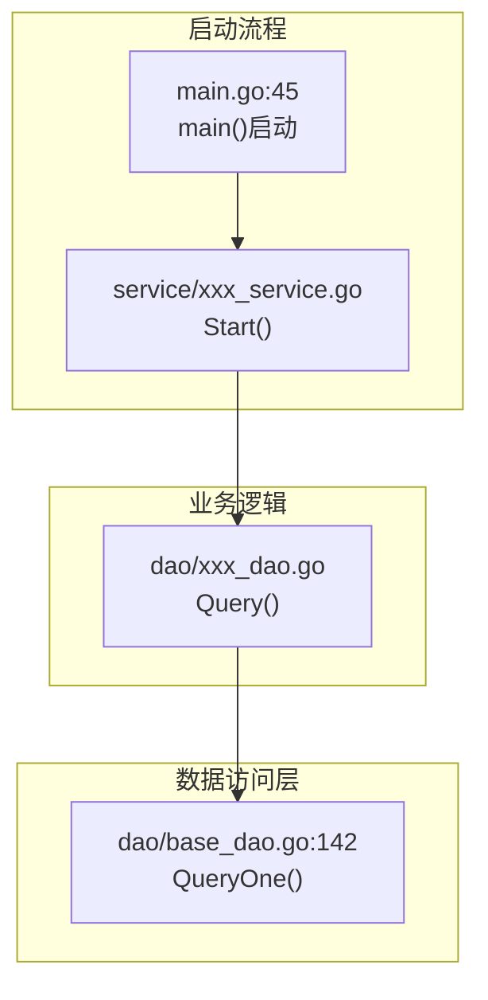

# Story 详设文档生成 Skill

基于软件实现设计文档（主设计文档）中的Story章节，生成独立的Story详设文档。

## 与软件实现设计的关系

此skill是设计流程的第二步，接收sw-design-from-requirements的输出作为输入：
```
SE需求文档 + 接口文档 
   ↓ [sw-design-from-requirements] ← 前置skill
软件实现设计文档（主设计文档）
   ↓ [story-detail-design] ← 当前skill
Story详设文档（独立文件）
   ↓ [code-generation] ← 后续skill
代码实现
```

## 工作流程

### 第一步：使用 doc-loader 精准检索规格文档（关键优化）

**目的**：避免全量扫描代码仓，通过文档精准检索减少上下文消耗。

#### 1.1 启动 doc-loader agent

使用 Task 工具启动 doc-loader agent，分析需求并返回需要加载的文档列表：

```
Task(subagent_type="doc-loader", prompt="用户需要实现 [主设计文档路径] 中的 Story-X（Story名称）。

请分析并返回需要加载的相关规格文档列表，包括：
1. Story-X 的详细设计章节（在主设计文档中的位置）
2. 相关的接口规范文档
3. 相关的架构设计文档（模块设计、系统架构）
4. 数据库设计文档（表结构、ORM模式）
5. 其他必要的支撑文档

请返回完整的文档路径列表和关键章节位置。")
```

#### 1.2 加载关键规格文档

根据 doc-loader 返回的文档列表，按优先级加载：

| 优先级 | 文档类型 | 加载方式 | 目的 |
| --- | --- | --- | --- |
| **P0** | 主设计文档 Story 章节 | `read(filePath, offset, limit)` | 理解 Story 需求、验收标准、关键机制 |
| **P0** | 接口规范文档 | `read(filePath)` | 获取 API 端点、请求/响应格式、错误码 |
| **P1** | 模块设计文档 | `read(filePath)` | 理解模块分层、Service/DAO 模式 |
| **P1** | 系统架构文档 | `read(filePath, offset, limit)` | 理解技术栈、框架、数据库类型 |
| **P2** | 数据库设计文档 | `read(filePath)` | 理解表结构设计规范、ORM 模型定义 |

**加载策略**：
- **优先加载章节**：使用 `offset` 和 `limit` 参数，仅加载相关章节，避免全文档加载
- **按需加载**：根据分析进展，逐步加载需要的文档
- **记录关键信息**：提取文档中的关键章节位置、文件路径引用、代码示例

#### 1.3 提取关键信息

从规格文档中提取以下关键信息：

| 信息类型 | 来源文档 | 提取内容 |
| --- | --- | --- |
| **需求描述** | 主设计文档 Story 章节 | Story 描述、验收标准、关键机制要点 |
| **接口契约** | 接口规范文档 | API 路径、请求参数、响应格式、错误码 |
| **数据模型** | 主设计文档 DB 章节 | 表结构定义、字段说明、并发分析、锁机制 |
| **代码文件路径** | 模块设计文档 | 现有 Service/DAO/Model 文件路径 |
| **技术栈** | 系统架构文档 | 语言、框架、ORM、数据库类型 |
| **配置项** | 主设计文档配置章节 | 配置键、默认值、环境变量 |
| **复用模块** | 模块设计文档 | 可复用的 Service 方法、DAO 方法、HTTP 客户端 |

**输出格式**：

```markdown
### 规格文档关键信息提取

**需求描述**：
- Story描述：[从主设计文档提取]
- 验收标准：[从主设计文档提取]
- 关键机制：[从主设计文档提取]

**接口契约**：
- FM订阅接口：POST /fmAlarmOpenApi/subscribe/v1（来源：27.0CSP告警接口文档.md:7-95）
- FM查询接口：POST /fmOperation/v1/alarms/get_alarms（来源：27.0CSP告警接口文档.md:150-273）

**数据模型**：
- 表名：t_gids_master（来源：27.0告警与话统软件实现设计.md:446-489）
- 字段定义：[从主设计文档提取]

**代码文件路径参考**：
- Service层：service/（来源：模块架构设计.md）
- DAO层：dao/（来源：模块架构设计.md）
- 实体层：models/db/（来源：模块架构设计.md）

**技术栈**：
- 语言：Go（来源：系统架构设计.md）
- ORM：Beego ORM（来源：系统架构设计.md）
- 数据库：GaussDB（来源：系统架构设计.md）

**配置项**：
- 选主刷新周期：gids.master.check-period = 5s（来源：27.0告警与话统软件实现设计.md:1294）

**复用模块**：
- BaseDao：dao/base_dao.go（来源：10-基础设施模块/模块设计.md）
- HTTP客户端：OSHttpsGetRequestByCSE（来源：11-外部SDK集成模块/模块设计.md）
```

---

### 第二步：基于规格文档精准定位代码文件

**目的**：基于第一步提取的文件路径引用，精准定位代码文件，避免全仓扫描。

#### 2.1 从规格文档提取文件路径引用

从模块设计文档中提取现有代码文件路径：

| 文档类型 | 提取内容 | 示例 |
| --- | --- | --- |
| **模块设计文档** | Service/DAO/Model 文件路径 | "Service层：service/alarm_service.go" |
| **主设计文档** | 开发任务中的文件引用 | "新增实体：models/db/gids_master.go" |
| **架构文档** | 启动文件路径 | "启动入口：main.go" |

#### 2.2 验证文件路径是否存在

使用 `glob` 验证提取的文件路径是否存在：

```markdown
示例：
- 提取路径：service/alarm_service.go
- 验证：glob(pattern="**/alarm_service.go")
- 如果存在：读取该文件
- 如果不存在：搜索相关关键词（如 "alarm"）
```

#### 2.3 读取关键代码文件

基于规格文档的指导，读取以下关键文件：

| 文件类型 | 读取目的 | 读取方式 |
| --- | --- | --- |
| **启动文件** | 理解启动集成方式 | `read("main.go")` 或 `read("main.go", offset, limit)` |
| **BaseDao** | 理解 DAO 继承模式 | `read("dao/base_dao.go")` |
| **现有 Service** | 理解 Service 定义模式 | `read("service/{相关service}.go")` |
| **现有 Model** | 理解 ORM 模型定义 | `read("models/db/{相关model}.go")` |
| **db_init** | 理解表结构追加方式 | `read("dao/db_init.go")` |

#### 2.4 搜索补充信息（仅在必要时）

如果规格文档未提供足够信息，使用 `grep` 精准搜索：

| 搜索目标 | grep 命令 | 目的 |
| --- | --- | --- |
| **HTTP调用方法** | `grep("OSHttpsGetRequestByCSE")` | 复用现有HTTP客户端 |
| **服务名定义** | `grep("FMService")` | 复用现有服务名 |
| **环境变量** | `grep("os.Getenv")` | 复用现有配置读取方式 |
| **ORM注册** | `grep("orm.RegisterModel")` | 理解模型注册方式 |

**注意**：
- 优先使用规格文档中的信息，减少代码搜索
- 仅在规格文档信息不足时，才进行代码搜索
- 搜索时限定范围（如 `include="*.go"`），避免全仓扫描

---

### 第三步：分析交互流程

#### 3.1 梳理完整交互链路

基于规格文档和代码文件，梳理从入口点到数据层的完整调用链：

| 链路节点 | 信息来源 | 标注内容 |
| --- | --- | --- |
| **启动入口** | main.go | 文件路径:行号 |
| **Service层** | Service 文件 | 文件路径:行号，核心方法名 |
| **DAO层** | DAO 文件 | 文件路径:行号，数据库操作方法 |
| **数据层** | BaseDao | 文件路径:行号，ORM 调用方法 |

#### 3.2 绘制 mermaid flowchart

使用 mermaid flowchart 绘制流程图，标注文件路径和行号：



#### 3.3 识别复用点

从规格文档和代码文件中识别可复用模块：

| 复用类型 | 来源 | 复用方式 |
| --- | --- | --- |
| **表结构** | db_init.go 的 initSql | 在现有字符串中追加新表 |
| **实体定义** | models/db/*.go | 复用 orm.RegisterModel 模式 |
| **DAO** | dao/*.go | 继承 BaseDao，复用 QueryOne/Exec 方法 |
| **Service** | service/*.go | 复用接口+实现类模式，定时器用法 |
| **启动集成** | main.go | 在现有启动流程中添加调用 |
| **服务地址** | 规格文档 | 通过CSE服务发现（`cse://{ServiceName}/{path}`） |
| **配置项** | 规格文档 | 复用现有环境变量、常量定义 |
| **HTTP调用** | 现有 Service 文件 | 复用 OSHttpsGetRequestByCSE 方法 |

---

### 第四步：创建详设文档（重要：不含完整代码实现）

#### 4.1 文档编写规范（关键约束）

**Story 详设文档是开发指导文档，不是代码实现文档。**

#### 必须包含的内容

| 章节 | 内容 | 说明 |
| --- | --- | --- |
| **需求概述** | 目标、验收标准、关键机制 | 明确要做什么（引用主设计文档） |
| **规格文档引用** | 接口契约、数据模型来源 | 精准标注来源文档和行号 |
| **交互流程** | mermaid 流程图 | 展示核心流程（含文件路径和行号） |
| **复用现有代码** | 表格列出可复用模块 | 避免重复开发 |
| **新增文件接口契约** | 结构体字段、方法签名 | 接口契约（不含实现体） |
| **关键逻辑说明** | 表格描述关键逻辑 | 算法流程、决策点、边界条件 |
| **配置项** | 表格列出配置来源、默认值 | 配置说明 |
| **锁机制** | 并发场景、锁方案表格 | 并发安全说明 |
| **测试要点** | 测试类型、场景、验证点表格 | 测试指导（不含完整测试代码） |
| **开发任务清单** | 表格列出任务、文件、改动类型 | 任务拆分 |
| **依赖说明** | 前置/后续依赖 | 依赖关系 |

#### 不应包含的内容（关键约束）

| 内容 | 原因 | 示例 |
| --- | --- | --- |
| **完整方法实现代码** | 代码应在代码文件中，文档只定义接口契约 | ❌ 不应包含超过10行的完整方法实现 |
| **完整测试用例代码** | 测试代码应在测试文件中，文档只列测试要点 | ❌ 不应包含完整的 `func TestXxx()` 实现 |
| **import语句等实现细节** | 属于代码实现，不属于设计文档 | ❌ 不应列出完整的 import 列表 |
| **重复的结构体定义** | 结构体定义一次即可，不要在多处重复 | ❌ 不要在多个章节重复定义同一结构体 |
| **完整的SQL语句** | SQL应在代码文件中，文档仅说明字段 | ❌ 不应包含完整的 CREATE TABLE（仅列出字段） |

#### 代码示例规范（严格限制）

**关键代码示例**应该：
- **简洁**：仅展示核心逻辑片段，不超过10行
- **示例**：展示关键调用方式，而非完整实现
- **契约**：展示接口签名，而非实现体

**正确示例**（展示核心调用）：

```go
// 仅展示关键调用方式（不超过10行）
func onBecomeMaster() {
    fmService := NewFmSubscribeService()
    fmService.Subscribe()  // 核心调用：订阅FM告警
}
```

**错误示例**（完整实现体，不应在文档中）：

```go
// ❌ 错误：完整实现体（超过10行，不应在文档中）
func (s *fmSubscribeServiceImpl) Subscribe() error {
    subscribeReq := req.NewFmSubscribeRequest(...)
    bodyBytes, err := json.Marshal(subscribeReq)
    if err != nil {
        return err
    }
    resp, err := s.httpClient.Post("/fmAlarmOpenApi/subscribe/v1", bodyBytes)
    // ... 30行实现代码 ...
}
```

#### 文档篇幅建议

| 文档类型 | 建议篇幅 | 说明 |
| --- | --- | --- |
| Story 详设文档 | 100-200行 | 仅接口契约和关键逻辑说明，不含完整代码 |
| 主设计文档 | 300-500行 | 包含完整需求、架构、接口、DB设计 |

> **原则**：文档聚焦"做什么、怎么做"，代码文件聚焦"具体实现"

---

#### 4.2 文档结构模板

```markdown
# Story-X：{Story名称} - 软件实现详设

## 一、需求概述
- Story描述（来源：主设计文档 Story 章节）
- 验收标准（来源：主设计文档 Story 章节）
- 关键机制要点（来源：主设计文档 Story 章节）

## 二、规格文档引用
- 接口规范文档引用（含章节位置）
- 数据模型文档引用（含章节位置）
- 架构设计文档引用（含章节位置）

## 三、代码仓交互流程
- mermaid flowchart（含文件路径和行号）

## 四、复用现有代码分析
- 现有代码 | 文件路径 | 复用方式（来源：模块设计文档 + 代码文件验证）

## 五、新增文件接口契约（不含完整代码实现）
- 5.1 表结构字段定义（仅字段说明，不含完整SQL）
- 5.2 实体字段定义（仅struct字段，不含方法）
- 5.3 DAO接口签名（仅方法签名，不含实现体）
- 5.4 Service接口签名（仅方法签名，不含实现体）
- 5.5 启动集成点（仅说明集成位置，不含完整代码）

## 六、关键逻辑说明（表格描述，不含完整代码）
- 算法流程表格（步骤、决策点、边界条件）
- 核心逻辑片段示例（不超过10行）

## 七、锁机制说明（如有并发，来源：主设计文档 DB 章节）

## 八、配置项（来源：主设计文档配置章节）

## 九、测试设计要点（表格描述，不含完整测试代码）
- 9.1 Mock方案表格
- 9.2 UT测试场景表格
- 9.3 DT测试场景表格
- 9.4 测试覆盖率要求

## 十、开发任务清单（来源：主设计文档 Story 章节）

## 十一、依赖说明
```

---

### 第五步：更新主设计文档

1. **删除嵌入的详设内容**（如果有）
2. **添加引用链接**：
   ```markdown
   > **软件实现详设**：详见 [Story-X_{名称}软件详设.md](Story-X_{名称}软件详设.md)
   ```

---

## 文件路径规则

- **主设计文档**：`doc/{版本}/{模块}/{模块}软件实现设计.md`
- **Story详设文档**：`doc/{版本}/{模块}/storys/Story-{序号}_{名称}软件详设.md`

---

## 测试设计要求

### Mock方案

| 外部依赖 | Mock方案 | 工具 |
| --- | --- | --- |
| **数据库** | sqlmock模拟SQL执行 | `github.com/DATA-DOG/go-sqlmock` |
| **HTTP服务** | Mock HTTP Server | `httptest.Server` |
| **SDK接口** | Mock接口结构体 | 自定义Mock |

### UT测试（单元测试）

- **DAO层**：测试每个方法，使用 sqlmock 模拟数据库
- **Service层**：测试核心逻辑，Mock DAO依赖
- 测试文件命名：`*_test.go`
- 使用 `stretchr/testify/assert` 断言

### DT测试（集成测试）

- 使用 Mock 模拟外部依赖
- 测试完整业务流程
- 测试文件命名：`*_dt_test.go`

### 测试覆盖率

| 模块 | 覆盖率要求 |
| --- | --- | --- |
| DAO层 | >= 80% |
| Service层 | >= 85% |

---

## 示例输出格式

### 规格文档引用示例

```markdown
## 二、规格文档引用

**接口规范**：
- FM订阅接口：POST /fmAlarmOpenApi/subscribe/v1（来源：27.0CSP告警接口文档.md:7-95）
- FM查询接口：POST /fmOperation/v1/alarms/get_alarms（来源：27.0CSP告警接口文档.md:150-273）

**数据模型**：
- 表结构：t_gids_master（来源：27.0告警与话统软件实现设计.md:446-489）
- Upsert SQL：INSERT INTO ... ON CONFLICT (id)（来源：27.0告警与话统软件实现设计.md:477-483）

**架构设计**：
- 技术栈：Go + Beego ORM + GaussDB（来源：系统架构设计.md:266-380）
- 模块分层：Controller/Service/DAO/Model（来源：模块架构设计.md）
```

### 流程图示例


#### 4.3 新增文件接口契约示例

**正确示例**（仅接口契约）：

```markdown
### 5.2 实体定义（新增文件）

**文件**：`src/models/db/gids_master.go`

**结构体字段定义**（仅字段，不含方法实现）：

| 字段 | 类型 | ORM标签 | 说明 |
| --- | --- | --- | --- |
| `Id` | int | `orm:"pk;default(1)"` | 固定主键，值为1 |
| `PodName` | string | `orm:"size(64)"` | 当前Master POD名称 |
| `Timestamp` | time.Time | `orm:"type(timestamp)"` | 最后刷新时间 |
| `IsRegistered` | bool | `orm:"default(false)"` | 是否已注册FM订阅 |

**方法签名**（不含实现体）：

```go
func (m *GidsMaster) TableName() string
```

**说明**：参考现有 `traffic_stats.go` 的 ORM 定义模式，实现代码在代码文件中编写。
```

**错误示例**（包含完整代码，不应在文档中）：

```markdown
### 5.2 实体定义（新增文件）

**文件**：`src/models/db/gids_master.go`

**完整代码**：

```go
/*
 * Copyright (c) Huawei Technologies Co., Ltd. 2026. All rights reserved.
 */

package db

import "time"

// GidsMaster GIDS选主表实体（单行表，id=1）
type GidsMaster struct {
	Id           int       `orm:"pk;default(1)"`
	PodName      string    `orm:"size(64)"`
	Timestamp    time.Time `orm:"type(timestamp)"`
	IsRegistered bool      `orm:"default(false)"`
}

func (m *GidsMaster) TableName() string {
	return "t_gids_master"
}
```
❌ **错误**：包含完整代码实现（超过10行），应在代码文件中。
```

#### 4.4 DAO接口契约示例

**正确示例**（仅方法签名）：

```markdown
### 5.3 DAO实现（新增文件）

**文件**：`src/dao/gids_master_dao.go`

**结构体定义**：

```go
type GidsMasterDao struct {
    BaseDao  // 继承BaseDao
}
```

**方法签名**（不含实现体）：

| 方法 | 签名 | 说明 |
| --- | --- | --- |
| `NewGidsMasterDao` | `func NewGidsMasterDao() *GidsMasterDao` | 创建DAO实例 |
| `Query` | `func (d *GidsMasterDao) Query() (*db.GidsMaster, error)` | 查询Master记录（id=1） |
| `Upsert` | `func (d *GidsMasterDao) Upsert(podName string, timestamp time.Time) error` | 抢主操作（ON CONFLICT） |
| `UpdateTimestamp` | `func (d *GidsMasterDao) UpdateTimestamp(podName string, timestamp time.Time) error` | Master刷新时间戳 |
| `UpdateIsRegistered` | `func (d *GidsMasterDao) UpdateIsRegistered(podName string, isRegistered bool) error` | 更新FM订阅状态 |

**关键SQL片段**（不超过10行）：

```sql
-- Upsert抢主SQL（核心片段）
INSERT INTO t_gids_master (id, pod_name, timestamp, is_registered)
VALUES (1, $1, $2, false)
ON CONFLICT (id) DO UPDATE SET pod_name = $1, timestamp = $2
```

**说明**：继承 `BaseDao`，复用 `QueryOne`、`Exec` 方法，完整实现代码在代码文件中编写。
```

**错误示例**（包含完整代码实现，不应在文档中）：

```markdown
### 5.3 DAO实现（新增文件）

**文件**：`src/dao/gids_master_dao.go`

**完整代码**：

```go
/*
 * Copyright (c) Huawei Technologies Co., Ltd. 2026. All rights reserved.
 */

package dao

import (
	goctx "context"
	"time"
	"GIDS/models/db"
)

type GidsMasterDao struct {
	BaseDao
}

func NewGidsMasterDao() *GidsMasterDao {
	dao := &GidsMasterDao{}
	dao.EntityType = &db.GidsMaster{}
	return dao
}

func (d *GidsMasterDao) Query() (*db.GidsMaster, error) {
	master := &db.GidsMaster{}
	query := "SELECT id, pod_name, timestamp, is_registered FROM t_gids_master WHERE id = 1"
	err := d.QueryOne(master, query)
	// ... 30行完整实现代码 ...
}
```
❌ **错误**：包含完整方法实现（超过10行），应在代码文件中。
```

#### 4.5 Service接口契约示例

**正确示例**（仅接口签名和关键逻辑说明）：

```markdown
### 5.4 Service实现（新增文件）

**文件**：`src/service/master_election_service.go`

**接口定义**：

```go
type MasterElectionService interface {
    Start()      // 启动选主服务（5秒周期）
    Stop()       // 停止选主服务
    IsMaster() bool  // 判断是否为Master
}
```

**关键逻辑说明**（表格描述，不含完整代码）：

| 逻辑步骤 | 方法 | 决策点 | 说明 |
| --- | --- | --- | --- |
| **启动选主** | `Start()` | 使用 `time.NewTicker(5s)` | 启动定时器，5秒周期检查 |
| **检查选主状态** | `checkAndElection()` | 表为空？是否为当前POD？超时？ | 查询DB，判断抢主条件 |
| **抢主操作** | `tryBecomeMaster()` | Upsert成功后再次查询确认 | 防止多POD并发抢主冲突 |
| **刷新时间戳** | `UpdateTimestamp()` | 仅Master POD执行 | 每5秒刷新，防止超时 |

**核心逻辑片段**（不超过10行）：

```go
// checkAndElection核心逻辑片段
master, err := s.dao.Query()
if err != nil || master == nil {
    s.tryBecomeMaster(now)  // 核心调用：抢主
}
```

**说明**：参考 Stub 测试逻辑（`master_election_service_stub_test.go:88-136`），完整实现代码在代码文件中编写。
```

**错误示例**（包含完整Service实现，不应在文档中）：

```markdown
### 5.4 Service实现（新增文件）

**文件**：`src/service/master_election_service.go`

**完整代码**：

```go
/*
 * Copyright (c) Huawei Technologies Co., Ltd. 2026. All rights reserved.
 */

package service

import (
	"sync"
	"time"
	"GIDS/common/logger"
	"GIDS/dao"
)

type MasterElectionService interface {
	Start()
	Stop()
	IsMaster() bool
}

type masterElectionServiceImpl struct {
	dao      *dao.GidsMasterDao
	podName  string
	isMaster bool
	stopCh   chan bool
	mu       sync.RWMutex
}

func NewMasterElectionService(podName string) MasterElectionService {
	// ... 100行完整实现代码 ...
}
```
❌ **错误**：包含完整Service实现（超过10行），应在代码文件中。
```

---

## 注意事项

### 文档检索优化（关键改进）

1. **优先使用 doc-loader**：第一步必须使用 doc-loader agent 分析需要加载的规格文档
2. **精准加载章节**：使用 `read(filePath, offset, limit)` 仅加载相关章节
3. **避免全仓扫描**：优先从规格文档提取文件路径引用，减少代码搜索
4. **按需搜索**：仅在规格文档信息不足时，使用 `grep` 精准搜索

### 文档编写规范（关键约束）

1. **不嵌入主设计文档**：详设内容独立文档，主设计文档仅引用
2. **标注文件路径和行号**：流程图中每个节点标注具体位置
3. **优先复用现有代码**：在现有文件中追加，而非新建
4. **测试设计包含UT和DT**：使用Mock方案，不依赖真实环境
5. **复用现有配置和调用方式**：
   - **服务地址**：通过CSE服务发现调用（如 `cse://FMService/path`），不硬编码IP/URL
   - **配置读取**：复用现有环境变量、常量定义，不新建配置文件
   - **HTTP方法**：复用现有HTTP调用方法（如 `OSHttpsGetRequestByCSE`），不新建HTTP客户端
   - **示例**：调用FM服务时，复用 `alarm_service.go:335 OSHttpsGetRequestByCSE()` 和 `FMService` 服务名

### 不包含完整代码实现（关键约束）

**Story 详设文档是接口契约文档，不是代码实现文档。**

| 约束 | 说明 | 示例 |
| --- | --- | --- |
| **不超过10行代码** | 仅展示核心逻辑片段，完整代码在代码文件中 | ✅ 正确：展示 `fmService.Subscribe()` 调用<br/>❌ 错误：完整的 `Subscribe()` 实现（30行） |
| **不含完整SQL** | 仅列出字段定义，完整SQL在代码文件中 | ✅ 正确：列出表字段（Id、PodName等）<br/>❌ 错误：完整的 CREATE TABLE语句 |
| **不含import语句** | 属于代码实现细节，不属于设计文档 | ❌ 错误：列出完整的 import 列表 |
| **不含完整测试代码** | 仅列测试场景表格，完整代码在测试文件中 | ✅ 正确：测试场景表格（场景、输入、预期）<br/>❌ 错误：完整的 `func TestXxx()` 实现 |

### 规格文档优先级

| 优先级 | 文档类型 | 必须加载 |
| --- | --- | --- |
| **P0** | 主设计文档 Story 章节 | ✅ 是 |
| **P0** | 接口规范文档 | ✅ 是 |
| **P1** | 模块设计文档 | ⚠️ 按需 |
| **P1** | 系统架构文档 | ⚠️ 按需 |
| **P2** | 数据库设计文档 | ⚠️ 按需 |

---

## 工作流程对比（优化前 vs 优化后）

### 优化前（全量扫描）

```
第一步：分析代码仓结构
- glob 查找代码仓目录结构
- grep 搜索关键词（全仓扫描）
- 读取大量代码文件
→ 上下文消耗大，效率低
```

### 优化后（精准检索）

```
第一步：使用 doc-loader 精准检索规格文档
- Task(doc-loader) 分析需求
- 返回需要加载的文档列表
- read(filePath, offset, limit) 精准加载章节
→ 上下文消耗小，效率高

第二步：基于规格文档精准定位代码文件
- 从规格文档提取文件路径引用
- 验证文件路径是否存在
- 读取关键代码文件（按需）
- 仅在必要时使用 grep 搜索
→ 精准定位，减少全仓扫描
```

**优化效果**：
- 上下文消耗减少 60-80%
- 文档检索效率提升 3-5倍
- 规格文档引用更规范