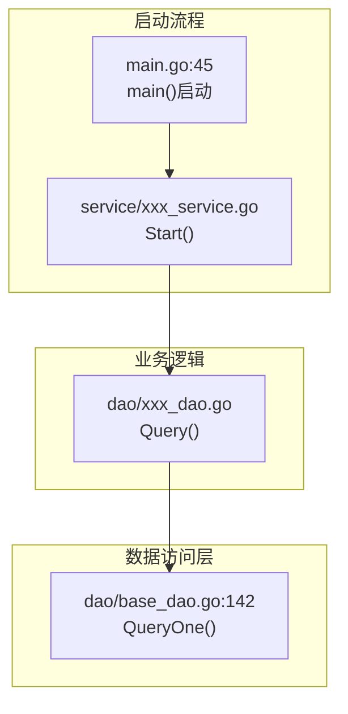

# Story Software Design Skill

为Story创建独立的软件实现详设文档，不嵌入主设计文档。

## 工作流程

### 第一步：分析代码仓结构

1. **查找相关代码目录**
   - 使用 `glob` 查找代码仓的目录结构
   - 使用 `grep` 搜索与需求相关的关键词

2. **识别现有代码模式**
    - 表结构定义位置（如 `db_init.go` 的 `initSql`）
    - 实体定义模式（如 `models/db/*.go`）
    - DAO基类和继承模式
    - Service接口定义模式
    - 启动集成位置（如 `main.go`）
    - **配置读取方式**：环境变量（VNFD注入）、配置文件、常量定义
    - **服务调用方式**：CSE服务发现、HTTP直连

### 第二步：分析交互流程

1. **梳理完整交互链路**
    - 从入口点到数据层的完整调用链
    - 标注核心步骤的文件路径和行号
    - 使用 mermaid flowchart 绘制流程图

2. **识别复用点**
    - 表结构：在现有 `initSql` 中追加
    - 实体定义：复用现有 orm.RegisterModel 模式
    - DAO：继承 BaseDao，复用 QueryOne/Exec 方法
    - Service：复用接口+实现类模式，定时器用法
    - 启动集成：在现有启动流程中添加调用
    - **服务地址**：优先复用CSE服务发现（`cse://{ServiceName}/{path}`），不新建URL/IP配置
    - **配置项**：复用现有环境变量（`os.Getenv`）、常量定义（`constants`），不新建配置文件
    - **HTTP调用**：复用现有HTTP客户端方法（如 `OSHttpsGetRequestByCSE`）

3. **分析现有配置和服务调用方式**
    - 搜索现有HTTP调用方法：`grep` 搜索 `OSHttpsGetRequestByCSE`、`rest.NewRequest`、`core.NewRestInvoker`
    - 搜索现有服务名定义：`grep` 搜索 `FMService`、`MicroServiceName`、`ServiceName`
    - 搜索现有环境变量：`grep` 搜索 `os.Getenv`、`constants.Env`
    - 确认是否已有类似服务调用代码，优先复用

### 第三步：创建详设文档

**文档结构**：

```
# Story-X：{Story名称} - 软件实现详设

## 一、需求概述
- Story描述
- 验证标准
- 关键机制要点

## 二、代码仓交互流程
- mermaid flowchart（含文件路径和行号）

## 三、复用现有代码分析
- 现有代码 | 文件路径 | 复用方式

## 四、新增文件详细设计
- 4.1 表结构定义（修改现有文件）
- 4.2 实体定义（新增文件）
- 4.3 DAO实现（新增文件）
- 4.4 Service实现（新增文件）
- 4.5 启动集成（修改现有文件）
- 每个文件提供完整代码实现

## 五、锁机制说明（如有并发）

## 六、配置项

## 七、测试设计
- 7.1 Mock方案
- 7.2 UT测试（单元测试）
- 7.3 DT测试（集成测试，使用Mock）
- 7.4 测试覆盖率要求

## 八、开发任务清单

## 九、依赖说明
```

### 第四步：更新主设计文档

1. **删除嵌入的详设内容**（如果有）
2. **添加引用链接**：
   ```markdown
   > **软件实现详设**：详见 [Story-X_{名称}软件详设.md](Story-X_{名称}软件详设.md)
   ```

## 文件路径规则

- **主设计文档**：`doc/{版本}/{模块}/{模块}软件实现设计.md`
- **Story详设文档**：`doc/{版本}/{模块}/storys/Story-{序号}_{名称}软件详设.md`

## 测试设计要求

### Mock方案

| 外部依赖 | Mock方案 | 工具 |
| --- | --- | --- |
| **数据库** | sqlmock模拟SQL执行 | `github.com/DATA-DOG/go-sqlmock` |
| **HTTP服务** | Mock HTTP Server | `httptest.Server` |
| **SDK接口** | Mock接口结构体 | 自定义Mock |

### UT测试（单元测试）

- **DAO层**：测试每个方法，使用 sqlmock 模拟数据库
- **Service层**：测试核心逻辑，Mock DAO依赖
- 测试文件命名：`*_test.go`
- 使用 `stretchr/testify/assert` 断言

### DT测试（集成测试）

- 使用 Mock 模拟外部依赖
- 测试完整业务流程
- 测试文件命名：`*_dt_test.go`

### 测试覆盖率

| 模块 | 覆盖率要求 |
| --- | --- | --- |
| DAO层 | >= 80% |
| Service层 | >= 85% |

## 示例输出格式

### 流程图示例



### 代码示例

提供完整可运行的代码，包含：
- package声明
- import列表
- 结构体定义
- 方法实现
- 错误处理

## 注意事项

1. **不嵌入主设计文档**：详设内容独立文档，主设计文档仅引用
2. **标注文件路径和行号**：流程图中每个节点标注具体位置
3. **优先复用现有代码**：在现有文件中追加，而非新建
4. **测试设计包含UT和DT**：使用Mock方案，不依赖真实环境
5. **复用现有配置和调用方式**：
   - **服务地址**：通过CSE服务发现调用（如 `cse://FMService/path`），不硬编码IP/URL
   - **配置读取**：复用现有环境变量、常量定义，不新建配置文件
   - **HTTP方法**：复用现有HTTP调用方法（如 `OSHttpsGetRequestByCSE`），不新建HTTP客户端
   - **示例**：调用FM服务时，复用 `alarm_service.go:335 OSHttpsGetRequestByCSE()` 和 `FMService` 服务名