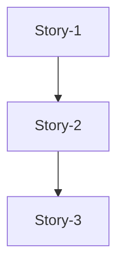
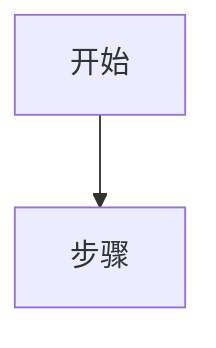

# 从需求文档生成软件实现设计

根据 SE 需求文档、接口文档，生成完整的软件实现设计文档。

## 何时使用

- 需要根据 SE 需求文档创建软件实现设计
- 需要根据接口文档补充技术细节
- 需要更新现有设计文档以匹配新需求

## 用户需提供

- SE 需求文档路径（包含功能需求、接口需求、数据需求）
- 接口文档路径（外部系统接口定义）
- 当前代码仓库路径（用于了解现有实现）

## 必须遵守

1. 先读取 SE 需求文档、接口文档，理解完整需求后再设计
2. **必须梳理存量代码**，确认可复用模块、技术栈、代码约定
3. 遵循现有代码库的技术栈、框架、命名约定
4. 遗留问题清单直接放在设计文档末尾，不单独文件
5. 所有设计决策必须有依据（需求引用或接口规范）
6. 代码示例必须与现有代码风格一致

## 实施步骤

### 步骤 1：理解需求

1. 读取 SE 需求文档，提取：
   - 功能需求列表
   - 接口需求（外部依赖）
   - 数据需求（存储、统计）
   - 非功能需求（性能、可靠性）

2. 读取接口文档，提取：
   - API 端点、方法、参数
   - 请求/响应格式
   - 错误码定义
   - 调用频率、超时要求

### 步骤 2：梳理存量代码（关键步骤）

**目的**：确认现有代码可复用的部分，避免重复设计。

#### 2.1 代码流程梳理（详细分析）

对于涉及数据库、外部服务调用的模块，需要详细梳理：

| 分析维度 | 具体内容 | 示例 Prompt |
| --- | --- | --- |
| **数据库交互流程** | 数据库句柄创建、连接池配置、事务处理 | "帮我总结服务与数据库交互的流程，具体到如何创建数据库句柄" |
| **数据模型存放** | 表结构定义位置、ORM 映射方式 | "数据库表的模型存放到哪里，字段如何定义" |
| **DAO 调用方式** | DAO 接口定义、实现类、调用入口 | "对应的 DAO 怎么调用的，有哪些查询方法" |
| **数据库配置** | 配置文件位置、环境变量、连接参数 | "GaussDB 是如何配置的，配置项有哪些" |
| **新增表设计参考** | 参考现有表设计新表 | "如果我想新增一张表存 XXX，表结构如何设计" |

**梳理方法**：

```markdown
1. 使用 Task 工具启动 explore agent，让 agent 深入分析代码：
   
   Task(description="梳理数据库交互流程", prompt="你是一个 Go 语言专家，读取 [代码目录] 下的代码，帮我总结服务与数据库交互的流程：
   - 如何创建数据库句柄
   - 数据库表的模型存放到哪里
   - 对应的 DAO 怎么调用的
   - GaussDB 是如何配置的
   - 如果我想新增一张表存一个服务拉起后唯一的 esn 码，表结构如何设计")

2. 将 agent 返回的分析结果整理到设计文档中
```

**输出格式**：

```markdown
### 数据库交互流程分析

**1. 数据库句柄创建**：
- 位置：`[文件路径]`
- 方式：[ORM 框架 / 手动连接]
- 连接池配置：[配置项说明]

**2. 数据模型存放**：
- 模型目录：`[目录路径]`
- 定义方式：[struct 定义示例]

**3. DAO 调用方式**：
- DAO 目录：`[目录路径]`
- 接口定义：`[接口名]`
- 实现类：`[实现类名]`
- 调用入口：`[service 文件]`

**4. 数据库配置**：
- 配置文件：`[文件路径]`
- 配置项：[配置项列表]

**5. 新增表设计参考**：
- 参考表：`[现有类似表]`
- 设计建议：[基于现有表的设计建议]
```

**示例输出**：

```
### 数据库交互流程分析（GIDS Go + Beego + ORM）

**1. 数据库句柄创建**：
- 位置：`GIDS/main.go`
- 方式：Beego ORM 自动初始化，通过 `orm.RunSyncdb()` 同步表结构
- 连接池配置：`app.conf` 中 `orm::maxconn` = 100

**2. 数据模型存放**：
- 模型目录：`GIDS/models/db/`
- 定义方式：
  ```go
  type SessionStats struct {
      Id         int64  `orm:"pk;auto"`
      SessionID  string `orm:"size(64)"`
      StartedAt  string `orm:"type(datetime)"`
  }
  ```

**3. DAO 调用方式**：
- DAO 目录：`GIDS/dao/`
- 基类：`BaseDao`，提供 `Insert()`、`QueryMulti()`、`DoTxWithCtx()`
- 调用示例：`dao.NewSessionLogDao().Insert(session)`

**4. 数据库配置**：
- 配置文件：`GIDS/conf/app.conf`
- 配置项：
  ```
  orm::driver = postgres
  orm::host = 127.0.0.1
  orm::port = 5432
  orm::database = gids_db
  orm::username = gids
  orm::password = ${DB_PASSWORD}
  ```

**5. 新增表设计参考**（t_esn_code）：
```sql
CREATE TABLE IF NOT EXISTS t_esn_code (
    id         SERIAL PRIMARY KEY,
    esn_code   VARCHAR(32) NOT NULL UNIQUE,
    created_at TIMESTAMP DEFAULT CURRENT_TIMESTAMP
);
```
- 参考：`t_session_stats` 表结构
- ORM 模型：
  ```go
  type EsnCode struct {
      Id        int64     `orm:"pk;auto"`
      EsnCode   string    `orm:"size(32);unique"`
      CreatedAt time.Time `orm:"auto_now_add;type(datetime)"`
  }
  ```
```

#### 2.2 查找可复用模块

| 检查项 | 方法 | 说明 |
| --- | --- | --- |
| **现有服务/接口** | `grep` 关键词搜索 | 查找是否已有类似功能实现 |
| **数据访问层** | 查找 DAO/Repository | 确认现有 DB 表结构和访问方式 |
| **配置读取** | 查找 Config 文件 | 确认配置读取方式（环境变量、配置文件） |
| **日志/监控** | 查找 Logger/Monitor | 确认日志框架、监控上报方式 |

#### 2.3 确认技术栈

| 组件 | 检查方式 |
| --- | --- | --- |
| **语言** | 查看文件扩展名（.go/.java/.py） |
| **框架** | 查看 pom.xml/go.mod/requirements.txt |
| **数据库** | 查找 DB 连接配置 |
| **HTTP 客户端** | 查找现有 HTTP 调用代码 |

#### 2.4 确认代码约定

| 约定 | 检查方式 |
| --- | --- |
| **命名风格** | 查看现有文件、函数命名 |
| **目录结构** | 查看项目目录布局 |
| **错误处理** | 查看现有错误处理方式 |
| **日志格式** | 查看现有日志调用示例 |

#### 2.5 输出存量分析结果

在设计中明确记录：

```markdown
### 存量代码分析

**可复用模块**：
- [模块名]：[文件路径]，可复用于 [功能]

**技术栈确认**：
- 语言：[语言]
- 框架：[框架]
- 数据库：[数据库类型]

**代码约定**：
- 命名风格：[风格说明]
- 错误处理：[处理方式]
```

**示例**：

```
### 存量代码分析

**可复用模块**：
- TrafficStatsService：GIDS/src/service/traffic_stats_service.go
  - GetOnline()：可复用于 SNMP 在线用户数上报
  - GetTrafficOfApp()：可复用于 SNMP 整机吞吐量上报

**技术栈确认**：
- GIDS：Go + Beego
- BGW：Java + Spring Boot
- MC：Go（待确认）

**代码约定**：
- GIDS：使用 logger.Infof()，配置通过 beego.AppConfig
- BGW：使用 @Value 注解读取配置，RestTemplate 发送 HTTP
```

### 步骤 3：设计文档结构

按照以下模板生成设计文档：

```markdown
# [功能名称] 软件实现设计

## 一、概述

### 1.1 文档信息

| 项目 | 内容 |
| --- | --- | --- |
| 版本 | v1.0 |
| 作者 | [作者] |
| 日期 | [日期] |

### 1.2 目标

[一句话说明本次设计的目标]

### 1.3 范围

**包含**：
- [功能点1]
- [功能点2]

**不包含**：
- [明确排除的范围]

### 1.4 存量代码分析

**可复用模块**：
- [模块名]：[文件路径]，可复用于 [功能]

**技术栈确认**：
- 语言：[语言]
- 框架：[框架]

**代码约定**：
- 命名风格：[风格说明]

## 二、整体设计

### 2.1 架构总览

[架构图或组件关系图]

### 2.2 数据流图

[数据从源头到终点的完整流程]

### 2.3 组件职责

| 组件 | 职责 | 技术栈 |
| --- | --- | --- |
| [组件A] | [职责] | [语言/框架] |

### 2.4 关键设计决策

| 决策 | 选择 | 原因 |
| --- | --- | --- |
| [决策点] | [选择] | [依据] |

## 三、接口设计

### 3.1 [外部系统名称] 接口

| 项 | 值 |
| --- | --- |
| API | [路径] |
| 方法 | [HTTP方法] |
| 协议 | [协议] |

**请求参数**：

| 参数名称 | 必选 | 域 | 说明 |
| --- | --- | --- | --- |
| [参数] | 是/否 | Header/Body | [说明] |

**响应格式**：

```json
{
  "field": "value"
}
```

## 四、DB 表结构设计

### 4.1 [表名]

```sql
CREATE TABLE IF NOT EXISTS [table_name] (
    id SERIAL PRIMARY KEY,
    -- 字段定义
);
```

**用途**：[表的作用]

**字段说明**：

| 字段 | 类型 | 说明 |
| --- | --- | --- |
| [字段] | [类型] | [说明] |

**并发访问分析**：

| 操作 | 执行者 | 频率 | 并发情况 |
| --- | --- | --- | --- |
| [操作] | [执行者] | [频率] | [并发情况] |

**锁机制设计**：

| 层面 | 是否需要锁 | 方案 |
| --- | --- | --- |
| DB 层 | 是/否 | [方案] |
| 应用层 | 是/否 | [方案] |

## 五、Story 拆分

### 5.1 Story 依赖关系



### 5.2 Story 列表

| Story ID | 名称 | 优先级 | 预估工时 | 依赖 |
| --- | --- | --- | --- | --- |
| Story-1 | [名称] | P0 | [工时] | - |

## 六、Story 详细设计

### 6.0 Story 文档规范

**Story 文档是开发指导文档，不是代码实现文档。**

#### 必须包含的内容

| 章节 | 内容 | 说明 |
| --- | --- | --- |
| **需求概述** | 目标、验收标准、关键机制 | 明确要做什么 |
| **交互流程** | mermaid 流程图 | 展示核心流程 |
| **复用现有代码** | 表格列出可复用模块 | 避免重复开发 |
| **新增文件清单** | 表格列出文件名、说明 | 明确改动范围 |
| **关键结构体** | 仅字段定义（不含方法实现） | 接口契约 |
| **关键接口** | 仅方法签名（不含实现体） | 接口契约 |
| **配置项** | 表格列出配置来源、默认值 | 配置说明 |
| **锁机制** | 并发场景、锁方案表格 | 并发安全说明 |
| **测试要点** | 测试类型、场景、验证点表格 | 测试指导 |
| **开发任务清单** | 表格列出任务、文件、改动类型 | 任务拆分 |
| **依赖说明** | 前置/后续依赖 | 依赖关系 |

#### 不应包含的内容

| 内容 | 原因 |
| --- | --- |
| **完整方法实现代码** | 代码应在代码文件中，文档只定义接口契约 |
| **完整测试用例代码** | 测试代码应在测试文件中，文档只列测试要点 |
| **import语句等实现细节** | 属于代码实现，不属于设计文档 |
| **重复的结构体定义** | 结构体定义一次即可，不要在多处重复 |

#### 代码示例规范

**关键代码示例**应该：
- 简洁：仅展示核心逻辑片段，不超过10行
- 示例：展示关键调用方式，而非完整实现

```go
// 正确示例：展示核心调用
func onBecomeMaster() {
    fmService := NewFmSubscribeService()
    fmService.Subscribe()  // 核心调用
}

// 错误示例：完整实现体（不应在文档中）
func (s *fmSubscribeServiceImpl) Subscribe() error {
    subscribeReq := req.NewFmSubscribeRequest(...)
    bodyBytes, err := json.Marshal(subscribeReq)
    // ... 30行实现代码 ...
}
```

#### 文档篇幅建议

| 文档类型 | 建议篇幅 |
| --- | --- |
| Story 详设文档 | 100-200行 |
| 主设计文档 | 300-500行 |

> **原则**：文档聚焦"做什么、怎么做"，代码文件聚焦"具体实现"

### 6.1 Story-1: [名称]

**目标**：[一句话说明]

**开发任务**：

| 任务 | 文件 | 改动内容 |
| --- | --- | --- |
| [任务1] | [文件路径] | [改动说明] |

**流程图**：



**关键结构体**（仅字段定义）：

```go
type XxxRequest struct {
    Field1 string `json:"field1"`
}
```

**关键接口**（仅方法签名）：

```go
type XxxService interface {
    DoSomething() error
}
```

**测试要点**：

| 测试类型 | 测试场景 | 验证点 |
| --- | --- | --- |
| UT | [场景] | [验证点] |

## 七、配置项

| 配置键 | 默认值 | 说明 |
| --- | --- | --- |
| [配置项] | [默认值] | [说明] |

## 八、DT 测试设计

### 8.0 测试框架

| 外部依赖 | Mock 方案 | 工具 |
| --- | --- | --- |
| [依赖] | [Mock方案] | [工具] |

### 8.1 测试用例

| 用例ID | 场景 | 输入 | 预期输出 |
| --- | --- | --- | --- |
| [ID] | [场景] | [输入] | [预期] |

## 九、风险评估

| 风险 | 影响 | 概率 | 缓解措施 |
| --- | --- | --- | --- |
| [风险] | [影响] | [概率] | [措施] |

## 十、遗留问题

| 问题 | 说明 | 状态 |
| --- | --- | --- |
| [问题] | [说明] | ❌ 待确认 / ✅ 已解决 |

## 十一、修订记录

| 版本 | 日期 | 说明 |
| --- | --- | --- |
| 1.0 | [日期] | 首版 |
```

### 步骤 4：填充设计内容

#### 4.1 架构设计

- 根据需求确定组件划分
- 绘制组件交互图（可用 mermaid）
- 明确各组件职责

#### 4.2 数据流设计

- 追踪数据从产生到消费的完整路径
- 标注每个节点的处理逻辑
- 明确数据格式转换点

#### 4.3 接口设计

- 直接引用接口文档内容
- 补充调用示例
- 说明错误处理

#### 4.4 DB 表设计

- 根据数据需求设计表结构
- 分析并发场景
- 设计锁机制

#### 4.5 Story 拆分

- 按功能模块拆分
- 明确依赖关系
- 标注优先级

#### 4.6 详细设计

- 每个独立的开发任务
- 关键代码示例（与现有代码风格一致）
- 流程图（mermaid）
- 测试要点

### 步骤 5：检查清单

生成文档后，检查以下内容：

- [ ] 所有需求点都有对应设计
- [ ] **存量代码已分析，可复用模块已列出**
- [ ] 接口参数与接口文档一致
- [ ] DB 表字段覆盖所有数据需求
- [ ] 并发场景有锁机制设计
- [ ] 遗留问题已列出
- [ ] 代码示例与现有代码风格一致

### 步骤 6：补充遗留问题

在文档末尾添加遗留问题清单：

```markdown
## 十、遗留问题

| 问题 | 说明 | 状态 |
| --- | --- | --- |
| **[问题名称]** | [详细说明] | ❌ 待 [确认方] 确认 |
| **[问题名称]** | [详细说明] | ⚠️ 待 [确认方] 确认标准值 |
| **[问题名称]** | [详细说明] | ✅ 已解决（解决方案） |
```

遗留问题类型：

- `❌ 待确认`：需要外部确认的问题
- `⚠️ 已定义临时方案`：已有临时方案，需最终确认
- `✅ 已解决`：问题已解决

## 本仓库参考路径

- SE 需求文档：`doc/27.0/告警与话统/27.0告警与话统需求.md`
- 接口文档：`doc/27.0/告警与话统/27.0告警接口文档.md`
- 设计文档模板：`doc/template/软件实现设计.md`
- 现有设计示例：`doc/27.0/告警与话统/27.0告警与话统软件实现设计.md`

## 验收标准

- [ ] 文档结构完整，包含所有必需章节
- [ ] **存量代码分析章节已填写，可复用模块已明确**
- [ ] 设计内容覆盖所有需求点
- [ ] 代码示例可编译/运行
- [ ] 流程图清晰易懂
- [ ] 遗留问题已列出并标注状态
- [ ] 修订记录已更新